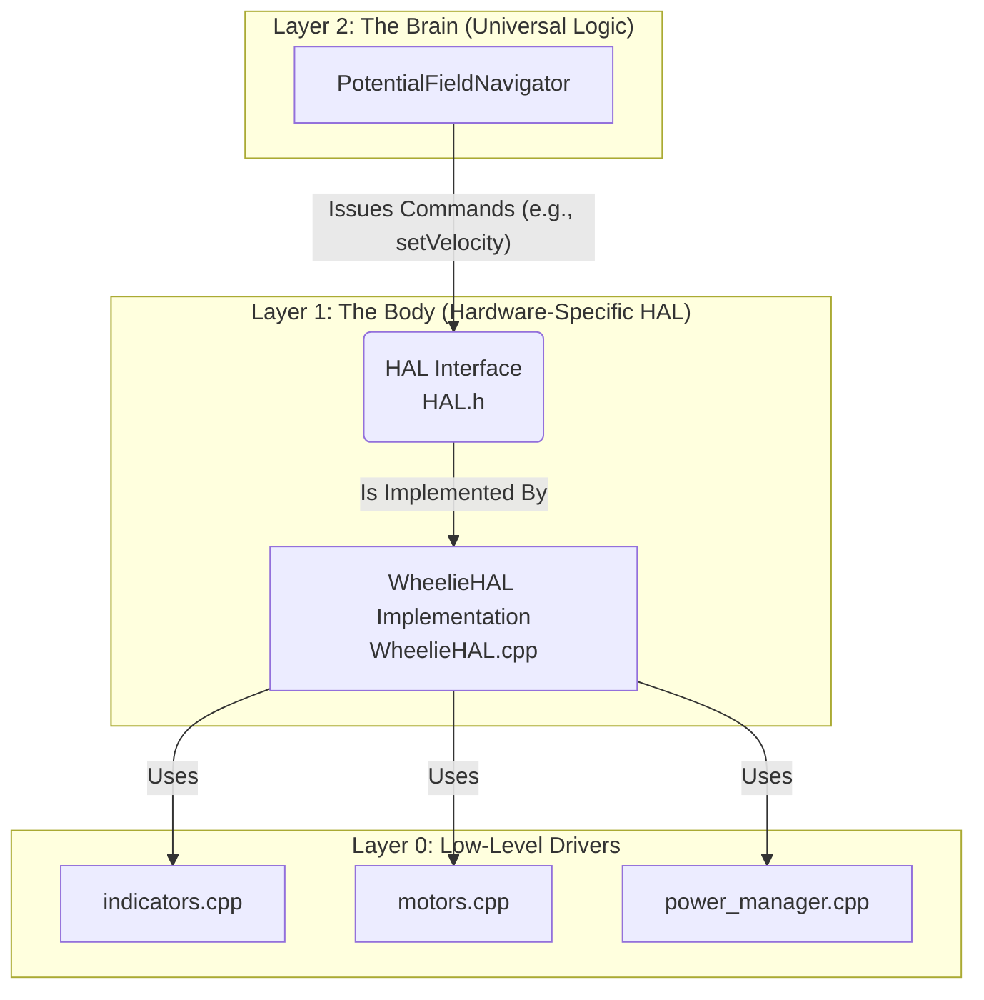

# Hardware Abstraction Layer (HAL) Architecture

This document outlines the design and purpose of the interface-based Hardware Abstraction Layer (HAL) in the project's firmware. The HAL is the cornerstone of the software architecture, enabling true separation between the robot's "Brain" and its "Body."

## 1. What is the HAL?

A Hardware Abstraction Layer is a layer of software that acts as a bridge between the high-level application logic (the "Brain") and the low-level hardware components (the "Body").

In this project, the HAL is defined by a formal C++ interface (an abstract class) in `HAL.h`. This interface acts as a "contract," defining a set of functions that any robot body must provide, such as `init()`, `update()`, `setVelocity()`, and `getPose()`.

The high-level navigation logic (the Brain) is programmed *only* against this generic interface. It has no knowledge of specific sensors or motor drivers.

A specific robot, like Wheelie, provides a concrete implementation of this interface in a class like `WheelieHAL`. This class contains all the hardware-specific code to make Wheelie's motors and sensors fulfill the contract.

## 2. Why Did We Choose a HAL Architecture?

Implementing a HAL was a deliberate architectural choice to gain several key benefits:

* **Multi-Robot Support & Scalability**: This is the primary benefit. We can create a completely new robot with different hardware (e.g., a mecanum-wheel robot called "Gizmo") by simply creating a new `GizmoHAL.cpp` file that implements the `HAL.h` interface. By changing only **one line** in `main.cpp` to use `GizmoHAL` instead of `WheelieHAL`, the exact same "Brain" (navigation, swarm logic) will work on the new robot.

* **True Separation of Concerns**: The architecture enforces a clean separation.
  * **The Brain (`PotentialFieldNavigator.cpp`)**: Thinks about goals, forces, and paths. It is hardware-agnostic.
  * **The Body (`WheelieHAL.cpp`)**: Translates the Brain's commands into concrete actions (e.g., PWM signals, I2C reads). It is hardware-specific.
    This prevents the creation of a monolithic, unmanageable `main.cpp` file where all logic is intertwined.

* **Modularity & Readability**: The code is organized into logical layers. The Brain's code is about high-level strategy, while the HAL implementation is about low-level execution. This makes the entire system easier to understand and maintain.

* **Testability**: The HAL interface allows for easier testing. We can create a "mock" HAL that simulates sensor data and motor responses to test the Brain's logic without needing physical hardware.

## 3. How is the HAL Structured?

The HAL architecture is composed of three distinct layers.

### Layer 1: The HAL Interface and Implementation

* #### `HAL.h` (The "Contract")

  * **Purpose**: An abstract class that defines the universal functions any robot body must provide. It is the single point of contact for the Brain.
  * **Key Functions**: `init()`, `update()`, `setVelocity()`, `getPose()`, `getObstacleRepulsion()`.

* #### `WheelieHAL.h` / `WheelieHAL.cpp` (The "Body")

  * **Purpose**: The specific implementation of the `HAL` interface for the Wheelie robot. This is where all the hardware-specific logic lives.
  * **Responsibilities**:
    * Initializes all of Wheelie's specific sensors (ToF, MPU6050, etc.).
    * Implements `getObstacleRepulsion()` by reading its ToF sensor and converting that distance into a force vector.
    * Implements `setVelocity()` by translating a desired velocity vector into the correct PWM signals for Wheelie's differential drive motors.
    * Calls the low-level drivers to perform its tasks.

### Layer 0: Low-Level Drivers

These are the modules that the `WheelieHAL` uses to interact with the hardware. They are no longer considered part of the HAL itself, but rather the tools the HAL uses.

* **`motors.cpp`**: Provides basic functions to control motor PWM.
* **`indicators.cpp`**: Manages the RGB LED and buzzer, including the non-blocking animation engine.
* **`power_manager.cpp`**: Monitors battery voltage.
* **`calibration.cpp`**: Handles the autonomous calibration sequence.

By adhering to this formal HAL architecture, the project is more robust, scalable, and well-prepared for a future with many different types of robots all running the same intelligent Brain.
