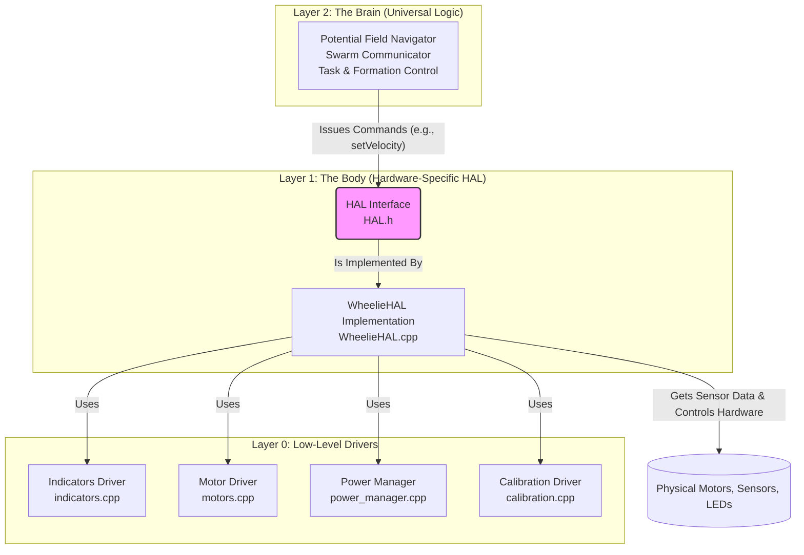

# 🤖 Wheelie - Advanced Autonomous ESP32 Robot

An advanced autonomous robot built on the ESP32 platform. It features a professional, layered software architecture with a Hardware Abstraction Layer (HAL), intelligent navigation, and a suite of enterprise-grade features.

## 🚀 Key Features

- 🏛️ **Professional Architecture**: A clean Hardware Abstraction Layer (HAL) separates the robot's "Brain" from its "Body," making the code modular, portable, and easy to extend to new robots.
- 🧠 **Intelligent Navigation**: Fluid navigation using a Potential Field algorithm, allowing the robot to flow around obstacles rather than stopping and starting.
- 🤖 **Autonomous Calibration**: A comprehensive, one-time self-calibration system that determines motor direction, turn radius, and distance metrics, saving the results to permanent memory.
- 🔋 **Smart Power Management**: 5-level battery management with automatic power scaling
- 📡 **Over-the-Air (OTA) Updates)**: Wireless firmware updates via PlatformIO, with RGB LED feedback
- 📊 **Professional Data Logging**: SPIFFS-based CSV logging with analytics and rotation
- 💡 **Generic Animation Engine**: A non-blocking system for creating complex LED and sound animations for startup, errors, and other events.
- 🧭 **Multi-Sensor Fusion**: ToF, IMU, edge detection for robust safety

---

## 🏛️ Software Architecture

The firmware uses a layered architecture centered around a Hardware Abstraction Layer (HAL). This design separates the high-level decision-making ("The Brain") from the low-level hardware control ("The Body").



---

## ⚡ Hardware Quick Reference

### Pinout Table

| Function | ESP32 Pin | Component |
| :--- | :--- | :--- |
| **Motors** | | |
| Left Motor IN1 | GPIO 23 | MOSFET H-Bridge |
| Left Motor IN2 | GPIO 22 | MOSFET H-Bridge |
| Right Motor IN1 | GPIO 19 | MOSFET H-Bridge |
| Right Motor IN2 | GPIO 18 | MOSFET H-Bridge |
| **Encoders** | | |
| Right Encoder | GPIO 5 | Encoder Module |
| Left Encoder | GPIO 33 | Encoder Module |
| **Indicators** | | |
| Red LED | GPIO 14 | RGB LED Module |
| Green LED | GPIO 12 | RGB LED Module |
| Blue LED | GPIO 13 | RGB LED Module |
| Buzzer | GPIO 21 | Piezo Buzzer |
| **Sensors** | | |
| I2C SDA | GPIO 26 | ToF, MPU6050 |
| I2C SCL | GPIO 27 | ToF, MPU6050 |
| Ultrasonic Trig | GPIO 16 | HC-SR04 |
| Ultrasonic Echo | GPIO 32 | HC-SR04 |
| Sound Sensor | GPIO 17 | Sound Module |
| **Power** | | |
| Battery Voltage | GPIO 34 | Voltage Divider |

### I2C Device Addresses

| Component | Default Address |
| :--- | :--- |
| VL53L0X ToF Sensor | `0x29` |
| MPU6050 IMU | `0x68` |

---

## 🛠️ Hardware

### Chassis & Motors

- **DollaTek 2WD Smart Robot Car Chassis Kit**
  - Includes: Acrylic chassis, 2x TT motors with wheels, speed encoders, battery box, front/rear casters
  - Alternative: Any 2WD robot chassis with TT motors

### Electronics - Core Components

- **ESP32 Development Board**: Type-C, CH340C chip, 30-pin, 2.4GHz WiFi/Bluetooth
- **ESP32 Breakout/Expansion Board**: 30-pin breakout for easier connections
- **XL4015 Buck Converter**: DC-DC step-down voltage regulator (4-38V to 1.25-36V, 5A max)
- **Dual MOS-FET H-Bridge Driver**: A high-efficiency driver (e.g., based on TB6612FNG or similar). More efficient than L298N, speed is controlled via PWM on IN pins.
- **Breadboard or Perfboard**: For connections (400-point recommended)
- **Jumper Wires**: Male-to-male, male-to-female, female-to-female
- **Power Supply**: 2x 3.7V 2000mAh Li-Po batteries (903042) in series for 7.4V 2000mAh
- **Voltage Divider Resistors**: 10kΩ and 3.3kΩ for battery monitoring circuit

### Sensors

- **VL53L0X GY-VL53L0XV2 Time-of-Flight Sensor** - 940nm laser ranging for obstacle detection (20-2000mm range)
- **MPU6050 GY-521 6-Axis IMU** - 3-axis accelerometer + 3-axis gyroscope for tilt detection and motion sensing
- **IR Edge/Cliff Sensor** (Optional, not installed) - Prevents falling off tables
- **H-1-0332 Sound Sensor Module** - Sound-reactive behaviors and audio detection
- **PIR Motion Sensor** (Optional, not installed) - Motion detection

### Indicators & Feedback

- **KY-009 RGB LED Module** - 3-color SMD LED board for status indication (DC 5V)
- **KY-006 Piezoelectric Buzzer** - Sound emitting device for audio feedback
- **Lithium Battery Capacity Indicator Module** - 3.7V Blue LED Display Board
- **2S Li-Po Charger Module** - USB-C boost charger for 7.4V battery pack (2S 1A)
- **Resistors** - 220Ω for LEDs, various values for sensors

### Hardware & Tools

- **M3 Screws and Nuts** - For mounting sensors and boards
- **Double-sided tape or mounting brackets**
- **Wire strippers and screwdrivers**
- **Multimeter** (for testing connections)

### Optional Upgrades

- **Ultrasonic Sensor (HC-SR04)** - Additional obstacle detection
- **Camera Module** - For vision-based navigation
- **Servo Motor** - For sensor scanning
- **LED Strip** - Enhanced visual feedback

---

## 🧰 Assembly & Setup Guide

### Step 1: Chassis Assembly

1. **Assemble the DollaTek chassis** following the included instructions
2. **Install TT motors** in the chassis motor mounts
3. **Attach wheels** to the motor shafts
4. **Install casters** (front and rear) for stability
5. **Mount battery box** under the chassis
6. **Test motor rotation** by connecting directly to battery

### Step 2: Electronics Mounting

1. **Mount ESP32** on the chassis using double-sided tape or brackets
2. **Mount MOSFET H-Bridge motor driver** (e.g., TB6612FNG or similar) near the ESP32
3. **Install breadboard** for sensor connections
4. **Position sensors** for optimal operation:
   - VL53L0X facing forward for obstacle detection
   - MPU6050 mounted securely (avoid vibration)
   - Edge sensor pointing downward at chassis edge
   - Sound sensor facing forward/upward

### Step 3: Power Wiring & Battery Monitoring

⚠️ **Always double-check polarity before connecting power!**

```txt
Battery Box (7.4V 2S LiPo) → Buck Converter IN+ → Motor Driver VM
Buck Converter OUT+ (set to 5V) → ESP32 5V Pin
All GND connections → Common ground rail

Battery Voltage Monitoring Circuit:
Battery + (7.4V) → 10kΩ Resistor → Junction → 3.3kΩ Resistor → GND
                                   ↓
                              ESP32 GPIO34 (ADC)

This voltage divider scales 8.4V max → 2.32V for safe ADC input
```

### Step 4: Motor Connections

```txt
MOSFET H-Bridge -> TT Motors
IN1/IN2 -> Left Motor
IN3/IN4 -> Right Motor
+MOSFET H-Bridge -> TT Motors
+IN1/IN2 -> Left Motor
+IN3/IN4 -> Right Motor
MOSFET H-Bridge -> TT Motors
OUT1/OUT2 -> Left Motor
OUT3/OUT4 -> Right Motor
```

### Step 5: ESP32 to MOSFET H-Bridge Connections

```txt
ESP32 GPIO → H-Bridge Pin
GPIO 23    → IN1 (Left Motor)
GPIO 22    → IN2 (Left Motor)
GPIO 19    → IN3 (Right Motor)
GPIO 18    → IN4 (Right Motor)
GND        → GND
```

### Step 6: Sensor Wiring

```txt
I2C Devices (ToF, MPU):
ESP32 GPIO 26 -> SDA
ESP32 GPIO 27 -> SCL
3.3V → VCC, GND → GND

Ultrasonic Sensor (HC-SR04) - Optional Rear Sensor:
ESP32 GPIO 16 -> TRIG
ESP32 GPIO 32 -> ECHO
5V -> VCC, GND -> GND

Edge Sensor (Optional):
ESP32 GPIO 15 → Signal
3.3V → VCC, GND → GND

Sound Sensor:
ESP32 GPIO 17 → Digital Out
3.3V → VCC, GND → GND

Encoders:
ESP32 GPIO 5  -> Encoder A (Right Wheel)
ESP32 GPIO 33 -> Encoder B (Left Wheel)
```

### Step 7: Indicators & Feedback

```txt
KY-009 RGB LED Module:
ESP32 GPIO 14 → R (Red)
ESP32 GPIO 12 → G (Green)
ESP32 GPIO 13 → B (Blue)
3.3V → VCC (+)
GND → GND (-)

Buzzer:
ESP32 GPIO 21 → Signal
3.3V → VCC, GND → GND

## 📚 Documentation

-See the `docs/` directory for detailed information:
The `docs/` directory contains detailed documentation. Key documents include:

- **HAL Architecture**: Explains the separation of Brain and Body.
- **Adding New Robots**: Guide to creating new HALs for different robot bodies.
- **Potential Field Navigation**: The theory behind the fluid motion system.
- **Enhancing the Brain**: How to add advanced features like learning and formation control.
- **OTA Guide**: Step-by-step instructions for wireless firmware updates.
- **Test Swapping Workflow**: How to use the script to run hardware tests.

---

@@ -237,12 +234,6 @@

---

-### Pin Configuration & Advanced Features
-
-See `src/main.cpp` for detailed pin definitions and wiring instructions.
-
----
-
## 🏗️ Building and Uploading

```sh
pio run --target upload
```

### Step 8: Testing & Calibration

1. **Power on** and check all connections
2. **Upload the code** using PlatformIO
3. **Open serial monitor** to view comprehensive diagnostics

- **Test each system**:
  - System health monitoring displays memory and performance stats
  - Motors should move in diagnostic sequence with power management
  - LEDs should cycle through colors indicating system status
  - Buzzer should play startup melody with diagnostic tones
  - Sensors should report valid readings with health monitoring
  - Battery voltage should display current level and power mode
  - OTA updates should be available over WiFi for remote programming (see [OTA Guide](docs/OTA_GUIDE.md))

### Step 9: Advanced Features Setup

1. **WiFi Configuration** - Robot connects automatically to configured network
2. **OTA Updates** - Enable secure remote firmware updates
3. **Data Logging** - SPIFFS file system logs operational data to CSV files
4. **Power Management** - System automatically adjusts performance based on battery level
5. **Health Monitoring** - Real-time system diagnostics and performance tracking

### Step 10: Mechanical Adjustments & Final Setup

1. **Balance the robot** - ensure it doesn't tip with battery and components
2. **Adjust caster heights** for smooth movement
3. **Secure all wiring** to prevent interference, especially voltage divider circuit
4. **Add cable management** for clean appearance and safety
5. **Test power management** - verify battery monitoring and power modes
6. **Validate OTA functionality** - ensure remote update capability works

### Troubleshooting Common Issues

| Issue | Possible Cause & Solution |
| :--- | :--- |
| **Motors don't move** | Check power supply and H-Bridge connections. Verify the robot is not in a low-power or error state. Run the `test_motors_only.cpp` sketch to isolate the hardware. |
| **Robot moves but veers or turns inaccurately** | This is almost always a calibration issue. Force a recalibration by using the `recalibrate` serial command or by holding the boot button on startup. Ensure the robot is on a flat surface during the IMU calibration phase. |
| **Calibration fails or gets stuck** | Ensure the robot has enough clear space to move during the dynamic calibration phases. Check that the encoders are wired correctly and providing readings. A faulty IMU can also cause calibration to fail. |
| **Random resets or "brownouts"** | The power supply cannot provide enough current. Ensure your batteries are fully charged and can handle a peak draw of ~3A. Check for short circuits in your wiring. |
| **Sensors not detected (I2C)** | Verify `SDA` (GPIO 26) and `SCL` (GPIO 27) wiring. Run an I2C scanner sketch to see if the devices are found at their expected addresses (`0x29` for ToF, `0x68` for IMU). |
| **Ultrasonic sensor gives strange readings** | Ensure the sensor is powered by 5V, not 3.3V. Check for "crosstalk" if you have multiple ultrasonic sensors; ensure they are not triggered simultaneously. |
| **Swarm communication (ESP-NOW) not working** | Both robots must be on the same WiFi channel. ESP-NOW initializes after the WiFi connection is made. Ensure both robots are connected to the same WiFi network first, even though ESP-NOW is peer-to-peer. |
| **OTA updates fail** | Verify your computer and the robot are on the same WiFi network. Double-check the IP address and password in your `platformio.ini` file. Ensure you are using the `ota` environment (`pio run -e ota -t upload`). |
| **Firmware won't build** | After pulling new code, delete the `.pio` directory at the root of the project and let PlatformIO reinstall all dependencies from scratch. |
| **Battery monitoring is inaccurate** | The voltage divider resistor values are critical. Use a multimeter to measure the actual battery voltage and the voltage at GPIO 34. Adjust the `BATTERY_VOLTAGE_DIVIDER_RATIO` in `power_manager.h` to match your real-world measurements. |

---

## 🚦 Getting Started

### Quick Start

1. **Get the parts** – See [Shopping List](docs/assembly/SHOPPING_LIST.md)
2. **Assemble the robot** – Follow the [Setup Guide](docs/assembly/SETUP_GUIDE.md)
3. **Wire the electronics** – Use the [Wiring Diagram](docs/assembly/WIRING.md)
4. **Setup development** – Install VS Code with PlatformIO extension
5. **Upload and test** – Build and upload the firmware

---

---

## 📚 Documentation

See the `docs/` directory for detailed information:

- [Autonomous Calibration Guide](docs/calibration/AUTONOMOUS_CALIBRATION_GUIDE.md) – The single source of truth for the calibration system
- [Manual Calibration Guide](docs/calibration/MANUAL_CALIBRATION_GUIDE.md) – For developers who need to perform manual tuning or debug calibration
- [OTA Guide](docs/OTA_GUIDE.md) – Step-by-step instructions for wireless firmware updates
- [Shopping List](docs/assembly/SHOPPING_LIST.md) – Complete parts list
- [Setup Guide](docs/assembly/SETUP_GUIDE.md) – Assembly instructions
- [Wiring Diagram](docs/assembly/WIRING.md) – Pin connections and electrical setup
- [ESP32 Type-C Guide](docs/components/ESP32_TYPE_C_GUIDE.md)
- [Breakout Board Guide](docs/components/BREAKOUT_BOARD_GUIDE.md)
- [Fasizi L298N Motor Driver](docs/components/FASIZI_L298N_GUIDE.md): *(Legacy, not used in current build. Use MOSFET H-Bridge for all new builds.)*
- [KY-009 RGB LED Module](docs/components/KY-009_RGB_LED_GUIDE.md)
- [Li-Po Battery Pack Guide](docs/power/LIPO_BATTERY_PACK_GUIDE.md)
- [XL4015 Buck Converter](docs/power/XL4015_POWER_GUIDE.md)
- [USB-C 2S Charger](docs/power/USB_C_2S_CHARGER_GUIDE.md)
- [Battery Indicator](docs/power/BATTERY_INDICATOR.md)
- [MPU6050 6-Axis IMU](docs/sensors/MPU6050_GY521_GUIDE.md)
- [VL53L0X ToF Sensor](docs/sensors/VL53L0X_GY_VL53L0XV2_GUIDE.md)
- [H-1-0332 Sound Sensor](docs/sensors/H-1-0332_SOUND_SENSOR_GUIDE.md)
- [LM393 H2010 Encoders](docs/sensors/LM393_H2010_ENCODER_GUIDE.md): *(Experimental/Optional: not required for main build. Only install if you want wheel feedback/odometry.)*
- [Main Firmware](src/main.cpp)

---

### PlatformIO Setup

1. Install VS Code
2. Install PlatformIO IDE extension
3. Open this project folder in VS Code
4. PlatformIO will automatically install all dependencies
5. Build and upload to your ESP32

---

### Pin Configuration & Advanced Features

See `src/main.cpp` for detailed pin definitions and wiring instructions.

---

## 🏗️ Building and Uploading

```sh
# Build the project
pio run
# Upload to ESP32
pio run --target upload
# Monitor serial output
pio device monitor
```

---

## 📄 License

MIT License

- [Wiring Diagram](docs/assembly/WIRING.md) – Pin connections and electrical setup
- [ESP32 Type-C Guide](docs/components/ESP32_TYPE_C_GUIDE.md)
- [Breakout Board Guide](docs/components/BREAKOUT_BOARD_GUIDE.md)
- [Fasizi L298N Motor Driver](docs/components/FASIZI_L298N_GUIDE.md): *(Legacy, not used in current build. Use MOSFET H-Bridge for all new builds.)*
- [KY-009 RGB LED Module](docs/components/KY-009_RGB_LED_GUIDE.md)
- [Li-Po Battery Pack Guide](docs/power/LIPO_BATTERY_PACK_GUIDE.md)
- [XL4015 Buck Converter](docs/power/XL4015_POWER_GUIDE.md)
- [USB-C 2S Charger](docs/power/USB_C_2S_CHARGER_GUIDE.md)
- [Battery Indicator](docs/power/BATTERY_INDICATOR.md)
- [MPU6050 6-Axis IMU](docs/sensors/MPU6050_GY521_GUIDE.md)
- [VL53L0X ToF Sensor](docs/sensors/VL53L0X_GY_VL53L0XV2_GUIDE.md)
- [H-1-0332 Sound Sensor](docs/sensors/H-1-0332_SOUND_SENSOR_GUIDE.md)
- [LM393 H2010 Encoders](docs/sensors/LM393_H2010_ENCODER_GUIDE.md): *(Experimental/Optional: not required for main build. Only install if you want wheel feedback/odometry.)*
- [Main Firmware](src/main.cpp)

---

### PlatformIO Setup guide

1. Install VS Code
2. Install PlatformIO IDE extension
3. Open this project folder in VS Code
4. PlatformIO will automatically install all dependencies
5. Build and upload to your ESP32

---

### Pin Configuration & Advanced Features guide

See `src/main.cpp` for detailed pin definitions and wiring instructions.

---

## 🏗️ Building and Uploading guide

```sh
# Build the project
pio run
# Upload to ESP32
pio run --target upload
# Monitor serial output
pio device monitor
