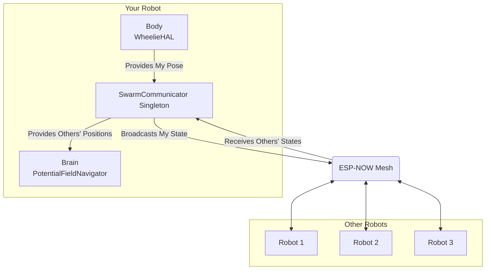

# 📡 SwarmCommunicator: ESP-NOW Mesh Networking

## Design Document for the Robot Fleet's Nervous System

---

## 1. Overview

The `SwarmCommunicator` is the core component that enables multiple robots to act as a cohesive swarm. It functions as the fleet's decentralized nervous system, allowing each robot to be aware of its neighbors' positions and states in real-time.

This system is the foundation for all emergent swarm behaviors, including:

- **Collision Avoidance**: Robots naturally space themselves out.
- **Formation Control**: Robots can organize into shapes like lines or wedges.
- **Task Allocation**: Robots can negotiate and distribute tasks among themselves.

---

## 2. Core Technology: ESP-NOW

We chose **ESP-NOW** as the communication protocol for its unique advantages in this context:

- **Low Latency**: ESP-NOW is a connectionless protocol, meaning messages are sent instantly without the handshake overhead of WiFi TCP/IP. This is critical for real-time navigation where sub-second updates are required.
- **No Router Required**: Robots communicate directly with each other (peer-to-peer). The swarm can operate in any environment, even without a central WiFi access point.
- **High Reliability**: While connectionless, ESP-NOW has built-in acknowledgments to confirm message delivery.
- **Low Power**: It is more energy-efficient than traditional WiFi, extending battery life.

---

## 3. Architecture & Design

The `SwarmCommunicator` is designed as a self-managing singleton that handles all the complexities of peer-to-peer networking.



### Key Design Principles

1. **Singleton Pattern**: The communicator is implemented as a singleton (`SwarmCommunicator::getInstance()`) to provide a single, globally accessible point for managing all swarm communications. This prevents conflicts and ensures consistent state.

2. **Automatic Peer Management**:
    - **Discovery**: When a robot broadcasts a message, it is automatically added as a peer on any robot that receives it. There is no complex pairing process.
    - **Heartbeat & Timeout**: Each robot maintains a list of known peers. If a message isn't received from a peer within a certain timeout period (e.g., 5 seconds), it is assumed to be out of range or offline and is removed from the active list. This keeps the peer list clean and relevant.

3. **Standardized Data Structure**: All communication uses a standardized `SwarmMessage` struct. This ensures that all current and future robots in the fleet speak the same language.

    ```cpp
    // A simplified version of the message structure
    struct SwarmMessage {
        uint8_t robotId;        // Unique ID of the sending robot
        float positionX;
        float positionY;
        float velocityX;
        float velocityY;
        // Future additions: task bids, battery level, etc.
    };
    ```

---

## 4. Data Flow and Usage

The `SwarmCommunicator` is seamlessly integrated into the main application loop.

1. **Update Own State**: In `loop()`, the application tells the communicator its current position and velocity by calling `setMyState()`.

    ```cpp
    // In main.cpp
    SwarmCommunicator::getInstance().setMyState(pose.position, navigator.getVelocity());
    ```

2. **Broadcast State**: The `SwarmCommunicator::update()` method is called continuously. Periodically (e.g., 5 times per second), it broadcasts the robot's current state to all other robots in the mesh.

3. **Receive and Store Peer State**: An ESP-NOW callback function runs asynchronously whenever a message is received. It updates the internal list of peers with the latest position and timestamp from the message.

4. **Provide Data to the Brain**: The `PotentialFieldNavigator` (the Brain) needs to know where other robots are to calculate swarm repulsion forces. It simply asks the communicator for this information.

    ```cpp
    // In main.cpp
    auto otherPositions = SwarmCommunicator::getInstance().getOtherRobotPositions();
    Vector2D swarmForce = navigator.calculateSwarmForce(otherPositions);
    ```

This clean interface abstracts away all the details of networking, broadcasting, and peer management. The Brain just asks a simple question: "Where is everyone else?"

---

## 5. Key Public Functions

The `SwarmCommunicator` provides a simple public API:

- `SwarmCommunicator& getInstance()`: Accesses the global singleton instance.
- `void begin()`: Initializes the ESP-NOW service, sets the device's MAC address as its unique ID, and registers the send/receive callbacks.
- `void update()`: The main update loop. Handles periodic broadcasting and peer list cleanup. This should be called in `loop()`.
- `void setMyState(Vector2D pos, Vector2D vel)`: Caches the robot's current state, ready for the next broadcast.
- `std::vector<Vector2D> getOtherRobotPositions()`: Returns a simple vector of positions for all currently active peers.

---

## 6. Extending the Swarm for Advanced Behaviors

This communication system is the essential substrate for the advanced features outlined in the `ENHANCING_THE_BRAIN.md` document.

- **Formation Control**: The leader of a formation can broadcast the target formation shape and center point. Follower robots receive this and adjust their goals accordingly.
- **Task Allocation**: The `SwarmMessage` struct can be expanded to include task "bids." Robots can broadcast available tasks, and other robots can bid on them based on their skills and proximity.
- **Collective Mapping**: Robots can broadcast information about discovered obstacles, allowing the entire fleet to build a shared map of the environment much faster than a single robot could.

By building on this robust and low-latency communication layer, the potential for emergent, intelligent swarm behavior is virtually limitless.
