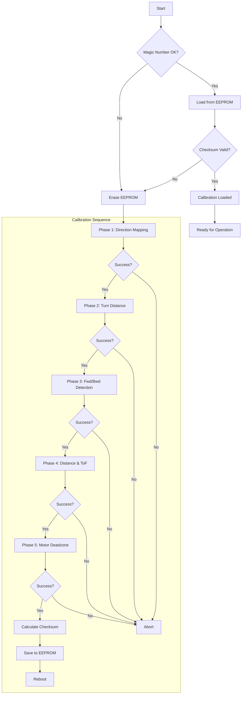

# 🤖 Autonomous Calibration System Guide

## Overview

This guide is the single source of truth for the Wheelie robot's autonomous calibration system. It is intended for both users/operators and developers/engineers, combining operational steps with advanced technical details.

The robot features an enterprise-grade autonomous calibration system that runs on first boot to ensure precise, consistent movement. It stores results in EEPROM, eliminating the need for manual tuning.

---

## 1. User/Operator Guide

### How It Works: The "Run-Once" Logic

On every boot, the robot checks its internal EEPROM memory for a "magic number" (a unique identifier, `0x7B`).

- **If the number is present**: The robot loads the stored calibration data and skips the calibration sequence, making boot-up very fast.
- **If the number is missing or the data is corrupt**: The robot runs the full, five-phase calibration sequence, saves the results to EEPROM, and then reboots automatically.

### How to Force Recalibration

If you make hardware changes (like changing motors or wheels) or if the robot isn't moving correctly, you can force a recalibration:

1. **Hold the BOOT button (GPIO0) while powering on the robot.**
2. The system will detect this, erase the old data, and automatically begin a new calibration sequence.

### Physical Setup for Calibration

Before starting, ensure the following for a successful calibration:

- The robot has **at least 1 meter** of clear space around it.
- There is a **wall or large, flat object** within 2 meters for the distance sensor to target.
- The robot is on a **flat, stable, and level surface**.
- The batteries are **fully charged**, as calibration can take 2-5 minutes.

### The Five-Phase Calibration Process

1. **Directional Mapping:** The robot tests different motor commands to determine which combination makes it turn left and right, using its IMU (gyroscope) to verify the direction of rotation.
2. **Turn Distance Calibration:** It finds the exact number of encoder ticks required to complete a precise 90° turn.
3. **Forward/Backward Detection:** It verifies which motor commands move the robot forward and backward by using its Time-of-Flight (ToF) distance sensor to see if it's getting closer to or farther from an object.
4. **Distance & ToF Calibration:** The robot moves a known number of encoder ticks forward and measures the actual distance traveled with its ToF sensor. This calibrates encoder ticks to real-world millimeters (`ticksPerMillimeter`) and calculates the sensor's physical offset.
5. **Motor Deadzone Calibration:** An advanced step that finds the minimum PWM power needed to overcome static friction. This ensures that even very small movements are reliable and executed correctly.

### Calibrated Movement Functions

After calibration, the robot can execute precise movements.

**Example API Usage:**

```cpp
// Turn exactly 90 degrees to the left
calibratedTurn90Left();

// Move exactly 200 millimeters forward
calibratedMoveDistance(200.0);
```

### Troubleshooting

| Issue | Symptom | Solution |
| :--- | :--- | :--- |
| **Repeated Calibration** | The robot calibrates on every startup. | Check power stability during calibration. Ensure the process completes without interruption. This could indicate an EEPROM write failure. |
| **Fails Phase 1 (Turns)** | Robot doesn't turn or turns incorrectly. | Check MPU-6050 (IMU) sensor connection and orientation. Verify motor connections and battery power. |
| **Fails Phase 2 (90° Turn)** | Robot turns but fails the phase. | Check encoder connections and ensure the encoder wheels are securely attached and spinning with the motors. |
| **Fails Phase 3/4 (Distance)** | Robot fails to detect forward movement. | Check VL53L0X (ToF) sensor connection. Ensure there is a clear, non-reflective target within the 20cm - 2m range. |
| **Fails Phase 5 (Deadzone)**| Robot jerks or fails to move smoothly. | This is an internal step. If other phases pass but movement is unreliable, check for mechanical issues (e.g., something blocking a wheel) or low battery. |

---

## 2. Technical/Developer Guide

### Data Integrity: CRC16 Checksum

To prevent data corruption, all calibration data saved to EEPROM is protected by a **CRC16-CCITT checksum**.

- On boot, the checksum is recalculated from the loaded data and compared against the stored checksum.
- If they don't match, the data is considered corrupt, and a full recalibration is automatically triggered.
- This detects nearly all possible data corruption events, including those from power loss during a write.

```cpp
uint16_t calculateCRC16(const uint8_t* data, size_t length);
```

### Granular Error Reporting

The calibration process uses specific error codes for easier debugging. Use `getCalibrationErrorString()` to get a human-readable message for a given error code.

```cpp
enum CalibrationResult {
    CALIB_SUCCESS = 0,
    CALIB_ERR_TIMEOUT,
    CALIB_ERR_NO_MOVEMENT,
    CALIB_ERR_SENSOR_INVALID,
    CALIB_ERR_CHECKSUM_FAILED,
    CALIB_ERR_DEADZONE_NOT_FOUND,
    // ... and others
};
```

### Thread-Safe Encoder Access

All encoder read and write operations are **atomic** (interrupt-protected) to prevent data corruption from race conditions, which is critical in a real-time system where interrupts can occur at any time.

```cpp
// Example of an atomic, thread-safe read
long safeReadLeftEncoder() {
    noInterrupts();
    long safeCopy = leftEncoderCount;
    interrupts();
    return safeCopy;
}
```

### EEPROM Memory Layout & Data Structure

The calibration data is stored in a `packed` struct to ensure a consistent memory layout across different compiler versions and prevent padding bytes.

```cpp
// The struct is packed to guarantee byte layout in EEPROM
struct __attribute__((packed)) CalibrationData {
    uint8_t magic;              // Magic number (0x7B) for validation
    uint8_t version;            // Calibration data structure version
    MotorDirections motorDirs;  // Motor direction mappings
    float ticksPer90Degrees;    // Encoder ticks for a 90° turn
    float ticksPerMillimeter;   // Encoder ticks per millimeter of travel
    float tofOffsetMM;          // ToF sensor's physical offset in mm
    MPUFlags mpuFlags;          // MPU sensor orientation flags
    uint8_t minMotorSpeedPWM;   // Minimum PWM to overcome static friction
    uint16_t checksum;          // CRC16 checksum for data integrity
};
```

| Address Range | Content | Size | Description |
|---------------|-------------------|------|--------------------------------|
| 0 | Magic | 1 | Magic number (`0x7B`) |
| 1 | Version | 1 | Calibration version |
| 2-9 | MotorDirs | 8 | Motor direction bit flags |
| 10-13 | TicksPer90Degrees | 4 | `float`: ticks per 90° |
| 14-17 | TicksPerMillimeter| 4 | `float`: ticks per mm |
| 18-21 | TofOffsetMM | 4 | `float`: ToF offset mm |
| 22 | MPUFlags | 1 | MPU orientation flags |
| 23 | MinMotorSpeedPWM | 1 | Minimum motor PWM |
| 24-25 | Checksum | 2 | CRC16 checksum |
| 26-511 | Reserved | 486 | Future expansion |

### Error Recovery Strategies

The system includes automatic recovery mechanisms for common, non-fatal failures.

```cpp
CalibrationResult recoverFromFailure(CalibrationResult failure) {
    switch (failure) {
        case CALIB_ERR_SENSOR_INVALID:
            initializeSensors();  // Attempt to re-initialize hardware
            return CALIB_SUCCESS;

        case CALIB_ERR_UNSTABLE:
            waitForStableConditions(); // Wait for motion to stop
            return CALIB_SUCCESS;

        case CALIB_ERR_CHECKSUM_FAILED:
            eraseCalibrationData(); // Force a full recalibration
            ESP.restart();
            return CALIB_SUCCESS;

        default:
            return failure; // Unrecoverable error
    }
}
```

### Calibration Process Flow



---

## 3. Performance & Safety

- **Accuracy:** Achieves turn accuracy of **±2°** and distance accuracy of **±5%** after calibration.
- **Reliability:** CRC16 checksums, granular error codes, and atomic operations ensure robust and predictable operation.
- **Safety:** All calibration phases include sensor validation, timeouts, and emergency stop capability to prevent hardware damage.
- **Maintainability:** The code is modular with clear error messages, comprehensive logging, and a single point of reference for documentation.

---

## 4. Future Enhancements

- **Adaptive Calibration:** Use machine learning to adapt calibration parameters based on battery level, surface type, or wear and tear.
- **Cloud Integration:** Offload calibration analytics for remote monitoring and fleet management.
- **Predictive Maintenance:** Detect calibration drift over time to predict hardware failures.

---

*This guide ensures both users and developers can operate, maintain, and extend the Wheelie robot's calibration system with confidence.*
